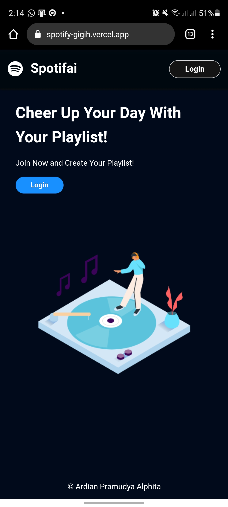

# Spotifai

Spotifai is an web application that intergated with the Spotify API. You can search your favorite tracks, create a new playlist, see new released tracks, see your top podcasts and see your available playlist.

> Since this project only use API in development mode, you cannot easily log in using your personal account, please contact me if you want to fully use it.

## Spotifai Features

---

This are some capabilities from this web application.

1. See new release tracks
2. See your top shows or podcasts
3. See your playlists
4. Search your favorite tracks
5. Create new playlist
6. See your profile in details

There are several pages in this web application.

1. **Home Page**
   In home page, you can see new release tracks, your top shows or podcasts and yout playlists.
2. **Search Page**
   In search page, you can search your favorite tracks and select it so that you can new create playlist with those tracks.
3. **Create Playlist Page**
   In create playlist page, you can define your playlist title and description, and finally you can create your playlist.
4. **Profile Page**
   In profile page, you can see your profile details such as, profile image, email and product type.
5. **Login Page**
   In login page, you can login with your Spotify account

## Spotifai Tech Stacks

---

This project was built using [React.js](https://reactjs.org/) with all the supported library, such as [react-router](https://reactrouter.com/) for the router, [react-redux](https://redux.js.org/) for the state management, [axios](https://github.com/axios/axios) to get the data from Spotify API, and [react-testing-library](https://testing-library.com/) and [msw](https://mswjs.io/) for testing. In this project, there is a little bit of Typescript, especially for the components. To make the UI/UX better, this project use [ant-design](https://ant.design/) for UI components library. Finally, to deploy this web application, this project use [Vercel](https://vercel.com/).

## Getting Started

---

This is the steps that you need to do if you want to try on your own.

### Run App

1. Clone this repository

```
git clone https://github.com/alphitardian/generasi-gigih-homework.git
```

2. Open the folder from your Command Prompt, Powershell or other terminal
3. Install the packages

```
npm install
//or
yarn install
```

4. Run the app

```
npm start
//or
yarn start
```

### Run Testing

This is the steps that you need to do if you want to try to test the web app with the available use-case or testing scenario.

1. Open the folder from your Command Prompt, Powershell or other terminal
2. Run the test

```
npm test
//or
yarn test
```

## Application Preview

---

| Desktop                                                                                      | Mobile                                                                                      |
| -------------------------------------------------------------------------------------------- | ------------------------------------------------------------------------------------------- |
|                      |                      |
|                        |                        |
|                    |                    |
|  |  |
|                     |                  |
